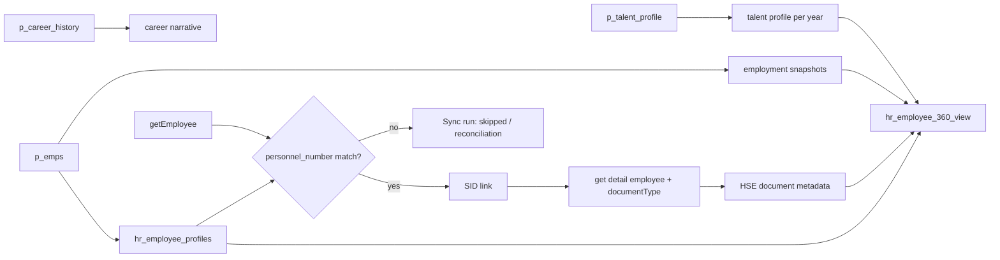

# Desain Integrasi BQ dan HSE CT

## Keputusan utama

`p_emps` adalah master employee BQ. `personnel_number` adalah business key untuk integrasi aplikasi; nilainya harus diperlakukan sebagai teks, tidak di-cast ke angka, agar nol di depan tidak hilang. `global_personnel_number` disimpan sebagai identifier tambahan, bukan pengganti key.

HSE CT dipautkan hanya jika `personnel_number` dari indeks employee HSE cocok persis dengan master BQ setelah trim. HSE SID disimpan pada `hr_hsect_employee_links` dan `hr_employee_source_identifiers`. Nama karyawan tidak boleh dipakai sebagai key join.



`hr_employee_360_view` adalah read model untuk layar directory/talent card. Ia menampilkan snapshot BQ dan talent year paling baru, serta jumlah dokumen HSE dan dokumen yang akan habis dalam 90 hari. Detail medis atau isi file dokumen tidak dimasukkan ke view.

## Kecukupan tiga tabel BQ

Tiga tabel ini sudah cukup untuk baseline employee directory, Talent profile, career narrative, Learning recommendation dasar, contract monitoring, dan sebagian Retirement monitoring.

Masih ada gap penting sebelum semua menu Harmoni dapat dianggap lengkap:

| Kebutuhan | Status | Data yang perlu ditambahkan |
| --- | --- | --- |
| Hierarki organisasi yang stabil | Belum | `position_code`, `department_code`, `division_code`, `directorate_code`, `reports_to_position_code`. Nama organisasi tidak stabil untuk key. |
| Job description dan competency matrix | Belum | Position code, skill code, required level, effective date, job description/responsibility. |
| Career timeline | Belum | Satu baris per event: event ID, movement type, position/organization code, start/end date, source effective date. Field career yang ada hanya narasi. |
| Status employment aktif/nonaktif | Belum eksplisit | Employee status dan termination/effective date. `data_period` sendiri tidak membuktikan status aktif. |
| Retirement | Sebagian | Tanggal lahir ada, tetapi perlu policy retirement age dan status/process extension dari SAP. |
| Promotion/rotation process | Sebagian | Tanggal terakhir ada, tetapi workflow/status transaksi dari SAP perlu sync terpisah. |
| HSE eligibility | Belum dari BQ | HSE CT sudah menyediakan endpoint, tetapi respons perlu dipetakan dan dipautkan lewat personnel number. |
| Onboarding operasional | Bukan BQ | Task, coaching, presentation, upload tetap ditulis oleh aplikasi. |

Field `ktp_passport`, `religion`, `marital_status`, dan `nationality` tidak diimpor ke tabel integrasi ini karena tidak dibutuhkan oleh read model HR yang dijelaskan. Akses tanggal lahir dan gender perlu dibatasi per peran; keduanya juga tidak dikirim ke fitur AI.

## Mapping BQ ke database

| Sumber | Target | Kunci/upsert |
| --- | --- | --- |
| `p_emps` | `hr_employee_profiles` | `personnel_number` |
| `p_emps` | `hr_employee_employment_snapshots` | `employee_id + data_period` |
| `p_talent_profile` | `hr_employee_talent_profiles` | `employee_id + talent_year` |
| `p_career_history` | `hr_employee_career_narratives` | `employee_id` |
| `getEmployee` HSE CT | `hr_hsect_employee_links` | `sid`; resolve employee via `personnel_number` |
| `documentType` HSE CT | `hr_hsect_document_records` | `employee_id + hsect_document_id` |

Semua upsert memelihara `source_updated_at` dan sync run dicatat pada `hr_integration_sync_runs`. Record HSE tanpa personnel number yang ditemukan di BQ tidak boleh dibuat sebagai employee baru otomatis; masukkan ke laporan rekonsiliasi lebih dulu.

## Kontrak pengambilan data

1. Scheduler BQ mengekspor tiga view terpilih ke satu berkas JSON yang bentuknya `{"sourceUpdatedAt":"...","p_emps":[],"p_talent_profile":[],"p_career_history":[]}`. Query ekspor harus whitelist kolom, tidak memakai `SELECT *`.
2. Jalankan `npm run db:import:bq-hr` dengan `BQ_HR_EXPORT_FILE` menunjuk ke berkas tersebut.
3. Job HSE CT memanggil `getCompany`, kemudian `getEmployee` secara paginasi untuk company terkait. Dari hasil list, ambil SID, personnel number, status MCU (`statusPermit`), dan daftar SIMPER. Untuk SID yang cocok dengan BQ, panggil `get detail employee` guna melengkapi deskripsi MCU. Endpoint bernama `get employee document` pada collection yang tersedia mengembalikan katalog tipe dokumen global, bukan dokumen milik employee, sehingga tidak boleh dipautkan ke setiap SID.
4. Normalisasi hasil HSE menjadi `{"sourceUpdatedAt":"...","employees":[{"personnel_number":"...","sid":"...","mcu_status":"...","simper_status":"...","documents":[]}]}`. `documents` hanya berisi SIMPER yang memang berada pada record employee. Jalankan `npm run db:import:hsect` dengan `HSECT_EXPORT_FILE`.
5. UI membaca `hr_employee_360_view`; HSE hanya ditampilkan sebagai status/count/expiry. Layar dengan dokumen detail harus punya otorisasi HSE/HR khusus.

Respons aktual telah mengonfirmasi mapping employee HSE: `sidCode` untuk SID, `employeeIdNumber` untuk personnel number, `statusPermit`/`descriptionPermit` untuk MCU, serta `hasActiveSimperDocuments` dan `simperDocuments` untuk SIMPER. Katalog `documentType` tidak boleh diperlakukan sebagai dokumen employee.

## Query BQ yang direkomendasikan

Gunakan view atau query eksplisit, misalnya untuk `p_emps`:

```sql
SELECT
  data_period, global_personnel_number, personnel_number, employee_name,
  date_of_birth, gender, hiring_date, join_date, company, personnel_area,
  personnel_subarea, employee_group, ps_level, layer, work_contract,
  end_of_contract, position_name, business_unit, direktorat, divisi,
  department, supervisor_nik, supervisor_name, office_email, hrbp_name,
  position_type, job_family, stem, value_chain, job_characteristics,
  job_grouping, critical_position, c_level
FROM p_emps;
```

Jangan ikut mengekspor `ktp_passport`, agama, status perkawinan, atau nationality untuk kebutuhan aplikasi saat ini. Tambahkan `source_updated_at` pada ketiga view BQ bila tersedia agar incremental sync bisa digunakan; bila belum ada, scheduler mengisi `sourceUpdatedAt` saat export dan menjalankan full upsert terjadwal.

## Keamanan HSE CT

Credential API yang ada di koleksi Postman adalah secret, bukan konfigurasi aplikasi. Pindahkan ke secret manager/server-side environment, rotasi key yang sudah terpapar, dan jangan commit koleksi atau nilai key tersebut. Jangan gunakan prefix `NEXT_PUBLIC_`, jangan log header/payload mentah, dan simpan hanya metadata dokumen yang diperlukan di aplikasi.
