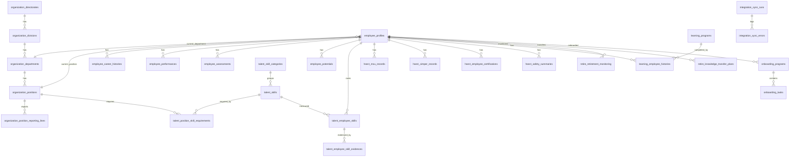

# Arsitektur Database HR Monitoring

## Stack

Aplikasi menggunakan Next.js 15, TypeScript, NextAuth, PostgreSQL, dan Prisma. Prisma sudah ada di repository, sehingga operational database HR Monitoring dibuat melalui migration SQL Prisma dan script seed/sync berbasis Prisma Client.

## Keputusan schema

Implementasi memakai prefix tabel, bukan PostgreSQL schema terpisah. Alasannya: repo sudah memakai satu datasource Prisma tanpa fitur multiSchema, dan prefix tabel lebih sederhana untuk migration, deployment Supabase/PostgreSQL pooler, serta tidak mengganggu model UI lama seperti `User`, `Profile`, `ProbationTask`, dan `Presentation`.

Prefix domain:

- `organization_*`
- `employee_*`
- `talent_*`
- `hsect_*`
- `learning_*`
- `retire_*`
- `onboarding_*`
- `integration_*`
- `audit_*`

Semua tabel operasional memakai UUID primary key, foreign key, index, `created_at`, `updated_at`, dan field provenance source pada tabel yang menerima data dari mock BigQuery/HSECT.

## Domain

Organization Development menyimpan directorate, division, department, position, dan reporting line.

Employee menyimpan profile master, career history, education, project assignment, performance, assessment, dan potential. Business key utama adalah `employee_number`; foreign key tetap memakai UUID.

Talent menyimpan skill category, skill, level definition, requirement posisi, employee skill, evidence, aspiration, promotion case, mobility case, dan successor pool.

HSECT menyimpan MCU, SIMPER, certification, dan safety summary secara terpisah dari Talent.

Learning, Retire, dan Onboarding masing-masing memiliki tabel domain sendiri. Onboarding tidak digabung ke Talent.

Integration menyimpan audit proses sync dan error sync. Audit menyimpan aktivitas aplikasi tanpa password, token, payroll, rekening, atau data keluarga.

## ERD

## Production notes

Gunakan SSL untuk database production, user database dengan privilege terbatas, backup PITR, monitoring slow query, dan connection pooler. BigQuery/HSECT production sebaiknya masuk ke staging table atau temporary import batch sebelum merge ke tabel operasional.
