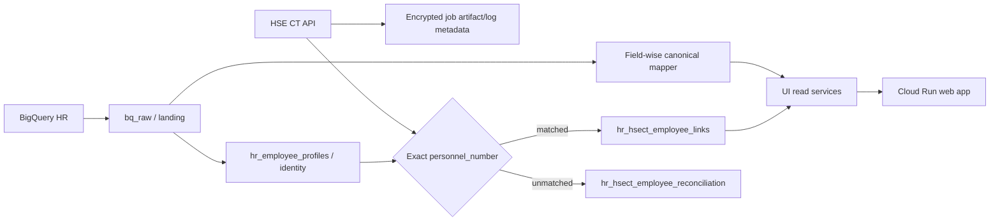

# Arsitektur Data HR Monitoring untuk GCP

## Keputusan

Aplikasi tidak boleh menganggap satu row terbaru di `p_talent_profile` sebagai profil lengkap. Satu employee dapat memiliki beberapa row tahunan dan setiap atribut dapat terisi pada tahun yang berbeda. Read adapter harus memilih **nilai non-kosong terbaru per kolom**, sedangkan data yang memang berupa history (`p_dp_history`, career, SIMPER) tetap dipertahankan sebagai kumpulan record.

`personnel_number` adalah business key lintas BQ, aplikasi, dan HSE. Nilai selalu diperlakukan sebagai teks dan hanya dinormalisasi dengan trim; jangan diubah menjadi angka dan jangan mencocokkan berdasarkan nama.

## Topologi

## Fungsi schema dan tabel

| Lapisan | Objek | Fungsi |
| --- | --- | --- |
| Raw/bronze | `bq_raw.*` | Salinan sumber untuk audit, replay, dan penambahan kolom tanpa mengubah data sumber. Tidak menyimpan keputusan bisnis. |
| Canonical/silver | `hr_employee_profiles` | Registry identity stabil dan UUID internal. Dibutuhkan sebagai foreign key untuk data aplikasi dan HSE. |
| Canonical/silver | `hr_employee_employment_snapshots`, `hr_employee_talent_profiles`, `hr_employee_career_narratives` | Riwayat terkurasi bila aplikasi perlu snapshot yang independen dari raw. Tidak wajib dibaca UI selama mapper raw masih menjadi sumber operasional. |
| HSE canonical | `hr_hsect_employee_links` | Relasi satu employee BQ dengan SID serta status MCU/SIMPER terbaru. |
| Data quality | `hr_hsect_employee_reconciliation` | Antrean exception HSE yang sampai ke importer tetapi tidak cocok dengan `p_emps`, agar dapat diperbaiki upstream. Prefilter job mencatat jumlah kandidat non-BQ sebagai metrik batch tanpa membuat employee baru. |
| Operational | `hr_integration_sync_runs` | Audit status, jumlah row, error, dan hasil setiap job. |

Raw tetap disimpan, tetapi UI tidak boleh menulis ke raw. Untuk ukuran data saat ini, UI memakai query read adapter yang terkontrol dan ber-index. Jika volume atau concurrency meningkat, query yang sama dipindahkan menjadi materialized view/read table tanpa mengubah komponen visual.

### Kapan tabel `hr_*` diperlukan

Tabel `hr_*` tidak dibuat untuk menyalin seluruh isi BigQuery. Master employee, talent profile, assessment, career, dan DP tetap dimiliki BQ dan dibaca dari `bq_raw` melalui read adapter. Tabel aplikasi/canonical hanya diperlukan bila salah satu kondisi berikut berlaku:

- aplikasi harus menyimpan data hasil input user, workflow, approval, atau status monitoring yang tidak ada di BQ;
- data eksternal seperti HSE membutuhkan UUID/foreign key internal dan reconciliation trail;
- aplikasi membutuhkan audit, versioning, atau histori keputusan yang tidak boleh hilang ketika raw BQ direfresh;
- identitas lintas sumber harus dipertahankan secara stabil.

Contohnya `learning_monitoring` hanya menyimpan overlay yang diedit Learning team; nama, posisi, dan organisasi employee tetap berasal dari BQ. `hr_employee_profiles` tetap berguna sebagai registry identity untuk relasi HSE dan workflow internal, tetapi tidak boleh menjadi salinan kedua seluruh kolom `p_emps`.

### Ownership data per modul

| Modul | Source of truth | Data aplikasi yang boleh ditulis |
| --- | --- | --- |
| Probation population | `bq_raw.p_emps.work_contract = 'probation'` setelah trim/case normalization | Task, presentation, reminder, dan keputusan probation untuk employee yang sudah diprovisioning. |
| Learning | Employee/talent evidence dari BQ | `learning_monitoring`: program, provider, timeline, status, success criteria, notes, actor, version. |
| Career Path | Evidence BQ + katalog posisi/competency OD | Hasil AI/audit di `talent_ai_analyses`; tidak mengubah master employee atau posisi. |
| HSE | HSE CT, exact join ke personnel number BQ | Link SID, status eligibility, reconciliation, dan sync audit. |

## Aturan mapping

1. `p_emps`: satu employee per `btrim(personnel_number)`; setiap field mengambil nilai non-kosong dari `data_period` terbaru.
2. `p_talent_profile`: setiap field mengambil nilai non-kosong dari `talent_year` terbaru. Nilai tahun `1900` diperlakukan sebagai sentinel/kosong.
3. `p_dp_history`: menghasilkan daftar hanya untuk employee yang benar-benar ada di tabel ini; semua program diurutkan dari tahun terbaru.
4. `p_assessment_history`: setiap field mengambil nilai non-kosong terbaru berdasarkan `assesment_date`.
5. HSE: pre-filter employee HSE dengan exact match ke `bq_raw.p_emps` sebelum memanggil detail API. MCU berasal dari `statusPermit`/`descriptionPermit`; SID dari `sidCode`; SIMPER dari `hasActiveSimperDocuments`/`simperDocuments`.
6. Null, string kosong, whitespace, dan `-` tidak boleh menimpa nilai historis yang valid.

## Urutan job dua kali sebulan

Gunakan satu Cloud Run Job yang berjalan berurutan agar aplikasi tidak membaca kombinasi batch yang berbeda:

1. Mirror BigQuery ke `bq_raw`.
2. Buat/pertahankan index dan jalankan `ANALYZE` (`npm run db:optimize:hr`).
3. Sinkronisasi HSE dengan koneksi database agar hanya personnel number BQ yang diambil detailnya.
4. Import HSE. Exception yang lolos sampai importer dicatat ke reconciliation queue; jumlah kandidat yang gugur di prefilter dicatat pada metrik/log job.
5. Jalankan pemeriksaan row count, duplicate key, match rate, serta status sync; job gagal jika batas kualitas tidak terpenuhi.

Cloud Scheduler dapat menjalankan Cloud Run Job memakai cron tanggal 4 dan 17, misalnya `0 2 4,17 * *` dengan timezone `Asia/Jakarta`. Web app dan job memakai service account berbeda dengan least privilege. Secret database/HSE disimpan di Secret Manager, bukan image atau environment file di repositori.

Referensi GCP resmi:

- Cloud Run Job terjadwal: https://docs.cloud.google.com/run/docs/execute/jobs-on-schedule
- Koneksi Cloud Run ke Cloud SQL PostgreSQL: https://docs.cloud.google.com/sql/docs/postgres/connect-run

## Performa

- Directory memakai query ringan yang tidak mengirim seluruh history talent.
- Detail Talent Card memfilter `personnel_number` di database; tidak lagi mengambil 1.248 profil lalu mencari satu orang di Node.js.
- Index expression dibuat untuk `personnel_number + period/year` pada lima tabel BQ utama dan statistik PostgreSQL diperbarui setelah raw refresh.
- Filter pencarian directory tetap client-side untuk 1.248 row. Jika populasi berkembang di atas puluhan ribu, pindahkan pencarian/filter/pagination ke server dan tambahkan trigram index untuk nama/posisi.
- Gunakan connection pooling Cloud SQL dan batasi pool per instance Cloud Run agar autoscaling tidak menghabiskan koneksi PostgreSQL.

## Quality gate target produksi

- `p_emps.personnel_number`: 100% non-null dan unik pada read model.
- `p_dp_history -> p_emps`: target 100% exact match.
- HSE -> BQ: monitor jumlah dan persentase match per batch; unmatched tidak dibuat sebagai employee baru.
- Tidak ada HSE document ID yang tertaut ke lebih dari satu employee.
- Implementasikan staging per `batch_id`, lalu publikasikan batch baru hanya setelah seluruh step sukses. Mekanisme swap/fallback atomik ini adalah target deployment GCP berikutnya; sync raw lokal saat ini belum melakukan publikasi batch atomik lintas semua tabel.
